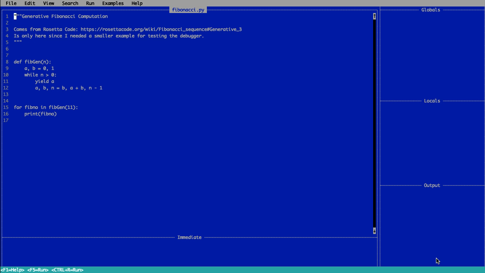

[](https://timothycrosley.github.io/quickpython/)
_________________

[](http://badge.fury.io/py/quickpython)
[](https://pypi.python.org/pypi/quickpython/)
[](https://pepy.tech/project/quickpython)
[](https://github.com/psf/black)
[](https://timothycrosley.github.io/isort/)
_________________

[Read Latest Documentation](https://timothycrosley.github.io/quickpython/) - [Browse GitHub Code Repository](https://github.com/timothycrosley/quickpython/)
_________________


**QuickPYTHON** A retro-futuristic educational interactive coding environment. Powered by Python and nostalgia.

Key features

- Mouse support
- Futuristic blue color scheme
- Auto-formatting
- Integrated Debugging Support
- Quick shortcuts for creating new dataclasses, static methods, etc
- Built-in help
- Games!

## Quick Start Instructions

```bash
pip install quickpython
```

then start with

```bash
qpython
```

or

```bash
quickpython
```
_________________

# What is different to the original version?

In this branch is a version of `quickpython` that contains a visual debugger: 


To debug your programs, you can use the following keys:

  * `ctrl+d` ... start/stop the debugger
  * `ctrl+b` ... set a breakpoint on the line under the cursor
  * `ctrl+n` ... execute the `n`ext line
  * `ctrl+i` ... step into execution of a function/method
  * `ctrl+c` ... continue execution until the next breakpoint is hit or the program ends


Technically, this visual debugger is done by wrapping `pdb` via `pexpect`.

Things that I think should be there but are not implemented yet:

  * The frames to the right `Locals`, `Globals`, `Output` should be of fixed height, scrollable in both directions, and they should only appear when the debugger is active.
  * Some of the output from PDB has to be removed from the displayed output, e.g., `--Return--`


*Disclaimer*: This project is provided as-is, for fun, with no guarantee of long-term support or maintenance.
